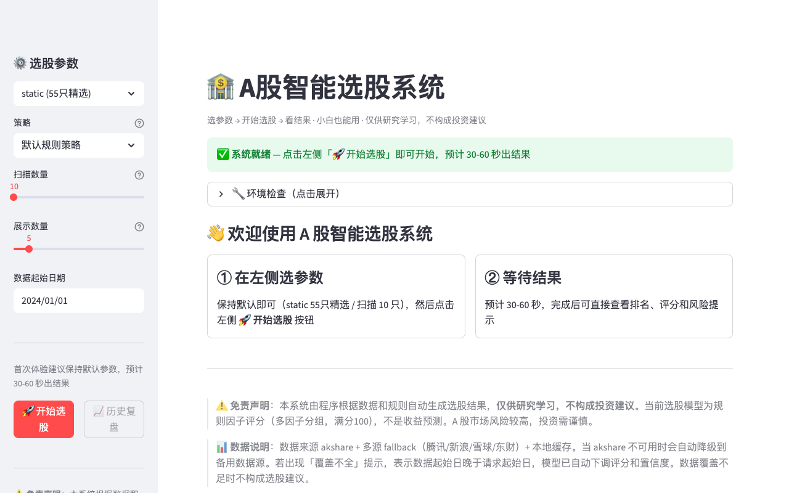
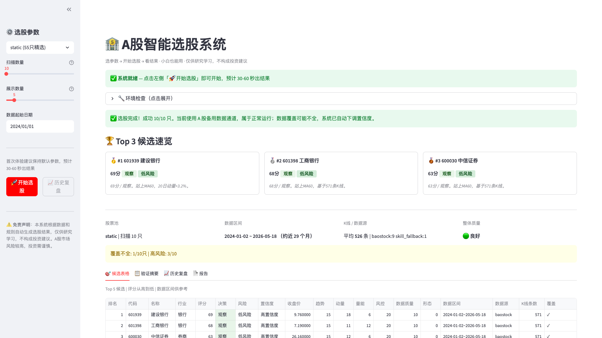

# 🏦 A 股智能选股系统 v0.5

> 🎯 小白也能用的可视化 A 股选股系统 — 双击就能用，不写一行命令。

基于 **akshare → baostock → skill_fallback + backtrader** 的 A 股选股系统。Streamlit 本地可视化界面，选参数 → 开始选股 → 看结果，含验证、复盘、报告和排障指南。**仅供研究学习，不构成投资建议。**

---

## 📸 预览

| 首页 | 选股结果 |
|------|---------|
|  |  |

> 上图：首页引导 + 环境自检 + 就绪状态（左）；选股完成后的首屏会直接显示完成状态、数据覆盖和覆盖不足说明，候选表格与验证摘要可在页面继续查看。

---

## ⚡ 三步启动

1. **安装备用数据通道**（仅首次，约 1 分钟）  
   双击 `scripts/install_fallback.command`

2. **启动系统**  
   双击 `start_ui.command` → 浏览器自动打开 `http://localhost:8501`

3. **开始选股**  
   点击「🚀 开始选股」→ 等待 30-60 秒 → 查看结果

> 💡 **不会写命令？** → [📖 小白使用指南](docs/USER_GUIDE.md) · 遇到问题 → [🛠️ 排障指南](docs/TROUBLESHOOTING.md)

---

## ✨ 当前能力 (v0.5 + P8)

- ✅ **可视化 UI**：Streamlit 本地界面，左侧参数 + 右侧结果，无需命令行
- ✅ **小白体验**：一键启动脚本、环境自检、选参数→开始选股→看结果、就绪状态判定
- ✅ **数据层**：akshare → baostock → skill_fallback + 缓存；baostock 稳定约 570 条 K 线
- ✅ **股票池**：static 55 只精选 A 股，含名称/行业元数据
- ✅ **选股引擎**：6 因子评分 + decision/risk_level/confidence
- ✅ **策略管理**：策略元数据注册表 + CLI/UI 策略选择入口（当前只有「默认规则策略」，不改变评分公式）
- ✅ **验证**：选股结果质量评估 + 历史窗口复盘（In-Sample）
- ✅ **报告**：Markdown 日报，含选股结果/数据来源/覆盖警告
- ✅ **截图证据**：Playwright 自动截图脚本，验收结果持久化到仓库
- ✅ **排障指南**：10 个小白常见问题，覆盖安装/启动/数据/端口/术语
- ✅ **Pipeline**：PASS/FAIL 退出码可信
- ✅ **UI 兼容性**：已清理 `use_container_width` / `applymap` 等废弃 API，首页/结果页截图已更新（P8.6-1/2）
- ✅ **启动验证**：`start_ui.command` 双击启动路径已冒烟验收通过（P8.6-3）
- ⏸️ **AI/qlib**：暂不进入当前评分、排序、数据链路和小白启动路径

---

## ⚠️ 已知限制与免责

| 限制 | 说明 |
|------|------|
| 数据覆盖 | baostock 稳定约 570 条 K 线（~2 年），覆盖充足；极端降级时数据量会减少 |
| 数据源波动 | akshare 偶发网络失败时自动降级到 baostock，极端情况下再用 skill_fallback |
| 选股等待 | 默认 10 只约 30-60 秒，数量越多越慢 |
| 非收益预测 | 评分为规则因子打分（满分 100），不是机器学习预测 |

> ⚠️ **免责声明**：本系统由程序根据数据和规则自动生成选股结果，**仅供研究学习，不构成投资建议**。A 股市场风险较高，投资需谨慎。

---

## 🚀 快速开始

> 💡 **不会写命令？** → 直接看 [📖 小白使用指南](docs/USER_GUIDE.md)，双击就能用。遇到问题看 [🛠️ 排障指南](docs/TROUBLESHOOTING.md)。

### 🖥️ 小白一键启动（推荐）

**双击 `start_ui.command`** 即可自动完成以下步骤：
1. 检测 Python3 → 创建虚拟环境 → 安装轻量依赖 → 启动 Streamlit
2. 浏览器打开 **http://localhost:8501**

首次使用前建议先双击 **`scripts/install_fallback.command`** 安装 A 股备用数据通道。  
说明：`akshare` 在部分网络环境下可能临时失败，系统会自动使用备用数据通道继续出结果；这不代表系统坏了。

左侧栏选择股票池、策略和参数，点击「🚀 开始选股」即可。首次体验建议保持默认 **static + 10 只**，通常需要 **30-60 秒**。当前只有「默认规则策略」，策略选择为将来扩展预留的入口，不改变评分公式。选股完成后可切换 Tab 查看候选表格、验证摘要、历史复盘和完整报告。

### 🔧 开发者启动（命令行）

```bash
python3 -m venv .venv
source .venv/bin/activate
pip install -r requirements.txt        # 完整依赖（含回测/AI）
# 或：pip install -r requirements-ui.txt  # 轻量依赖（仅可视化）
.venv/bin/streamlit run app.py
```

### 小白首次安装数据通道（推荐）

双击 `scripts/install_fallback.command` 即可自动安装 A 股备用数据通道。安装完成后，再双击 `start_ui.command` 启动系统。

### Skill 手动安装（数据 fallback）

```bash
cd /tmp && git clone https://github.com/shouldnotappearcalm/a-share-skill.git
cp -R /tmp/a-share-skill/a-share-data ~/.agents/skills/
cp -R /tmp/a-share-skill/a-share-paper-trading ~/.agents/skills/
cp -R /tmp/a-share-skill/a-share-strategy-mainboard-multi-swing-defensive ~/.agents/skills/
cp -R /tmp/a-share-skill/macd-trend-resonance-stock-picker ~/.agents/skills/
cp -R /tmp/a-share-skill/macd-second-golden-cross ~/.agents/skills/
```

---

## 📖 CLI 命令（开发者/验收入口）

### 发布前一键验收（维护者用）

```bash
python3 scripts/confirm_release_ready.py
```

> 维护者/发布前验收用，聚合语法检查、UI 验收、策略验收、CLI 选股/报告等 9 项检查。不是小白日常使用步骤。

### 查看股票池

```bash
python3 main.py universe --universe static --limit 50
python3 main.py universe --universe hs300 --limit 50
python3 main.py universe --universe top_amount --limit 50
```

### 批量选股

```bash
python3 main.py select --universe static --limit 50 --top 10 --start 2024-01-01
python3 main.py select --universe hs300 --limit 50 --top 10 --start 2024-01-01
python3 main.py select --universe top_amount --limit 50 --top 10 --start 2024-01-01
python3 main.py select --symbols 600519,000001,300750 --top 3
python3 main.py select --universe static --limit 10 --top 5 --strategy default  # 指定策略（不传等同默认策略）
```

### 验证结果

```bash
python3 main.py validate
python3 main.py validate --selection reports/output/selection_latest.json
```

### 历史复盘

```bash
python3 main.py backtest-validate
python3 main.py backtest-validate --selection reports/output/selection_latest.json --top 10
```
> 历史窗口复盘：对已有K线做 in-sample 验证，不代表未来收益。

### 生成报告

```bash
python3 main.py report
python3 main.py report --selection reports/output/selection_20260514.json
```

### 模块检查

```bash
python3 main.py pipeline
```

### 其他

```bash
python3 main.py selfcheck              # 数据源自检
python3 main.py fetch --type kline ... # 数据获取
python3 main.py backtest --symbol 000001  # 回测
python3 main.py paper-trading          # 模拟交易
```

---

## 📊 评分模型

当前为**规则因子评分模型**（非机器学习预测）。满分 100，分 6 组：

| 因子组 | 满分 | 说明 |
|--------|------|------|
| data_quality | 10 | 数据条数、覆盖完整性 |
| trend | 25 | MA5/MA20/MA60 多头排列 |
| momentum | 20 | 20日/60日涨跌幅、回撤 |
| volume | 15 | 量能放大倍数 |
| risk | 20 | RSI、追高风险、波动率（越高越好） |
| pattern | 10 | MACD、回踩形态 |

**决策标签**：strong_watch（强观察）→ watch（观察）→ neutral（中性）→ avoid（回避）
**风险等级**：low / medium / high
**置信度**：high / medium / low。coverage_warning 或 rows<120 时会降低 data_quality 和 confidence；若 confidence=low 或 data_quality 过低，decision 会被下调；若仍为 strong_watch，报告必须提示覆盖不足风险。

## 📋 验证摘要说明

`validate` 命令评估本次选股结果质量，不预测收益。`selection_latest.json` 自动包含 validation 字段。

**overall_quality**：
- `good` — 数据充足、风险可控
- `usable_with_caution` — 覆盖不足或置信度偏低
- `poor` — 无可用结果

**关键指标**：coverage_warning_ratio（覆盖不足比例）、confidence_dist（置信度分布）、decision_dist（决策分布）、risk_level_dist（风险分布）、sector_dist（行业分布）

## 🏗️ 架构

```
a-share-selection-system/
├── app.py                  # Streamlit UI 入口
├── main.py                 # CLI 入口
├── data/                   # 数据层 (fetcher/universe/cache)
├── strategies/             # 选股策略 (selection/registry)
├── validation/             # 验证层 (selection/backtest validator)
├── backtest/               # 回测引擎 (backtrader)
├── reports/                # 报告生成器 + output/
├── scripts/                # 脚本 (启动/安装/截图)
├── docs/                   # 文档 (截图/指南/排障/验收)
├── config/                 # 配置
├── agent/                  # AI Agent (暂存，不进入当前主链路)
├── paper_trading/          # 模拟交易
└── ai_models/              # AI 模型 (暂存，不进入当前主链路)
```

## 📚 文档索引

| 文档 | 说明 |
|------|------|
| [📖 小白使用指南](docs/USER_GUIDE.md) | 不会写命令的人看这个，双击就能用 |
| [🛠️ 排障指南](docs/TROUBLESHOOTING.md) | 打不开/没数据/一直等待等 10 个常见问题 |
| [📋 UI 验收结果](docs/UI_ACCEPTANCE_RESULT.md) | P8.6 UI 兼容性修复 + 冒烟验收 + 启动脚本验收 |
| [🧪 小白人工验收清单](docs/MANUAL_UI_CHECKLIST.md) | 小白手动 UI 验收清单 |
| [📋 发布前总复盘](docs/P8_7_RELEASE_REVIEW.md) | 发布前总复盘与下一阶段边界 |
| [📝 变更日志](CHANGELOG.md) | v0.5 已完成能力一览 |
| [✅ 发布检查清单](RELEASE_CHECKLIST.md) | 发布前逐项检查 |
| [📂 项目状态](PROJECT_STATE.md) | 开发阶段/commit 记录/真实能力 |

## 📄 许可证

仅供研究学习使用。不构成投资建议。
